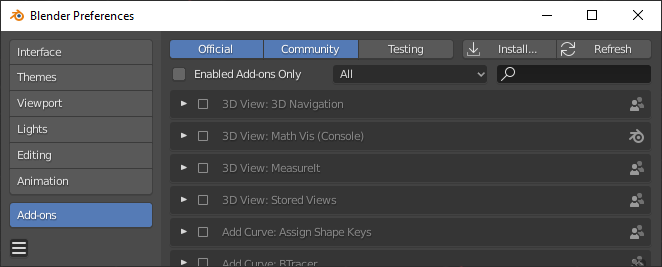
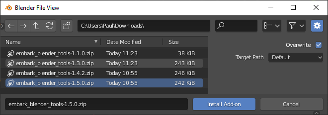
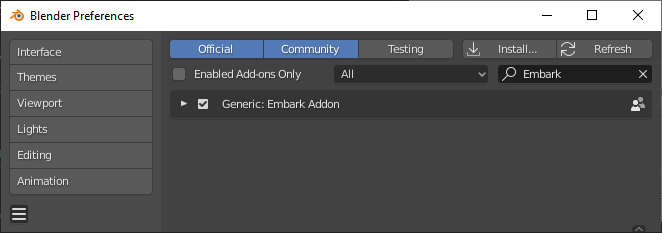
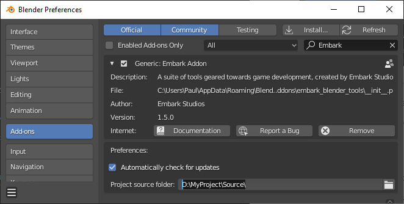
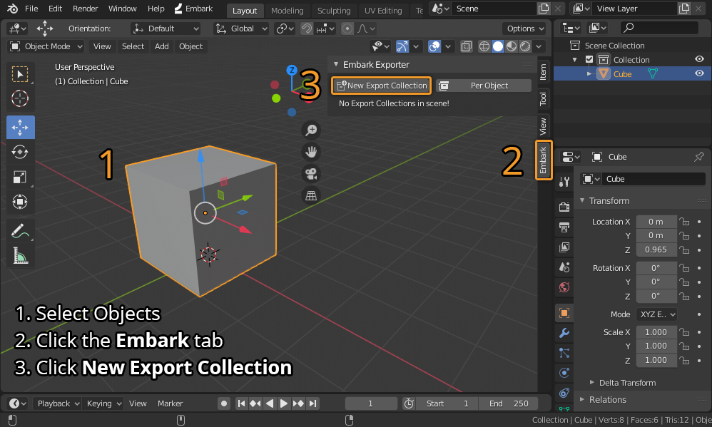
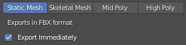
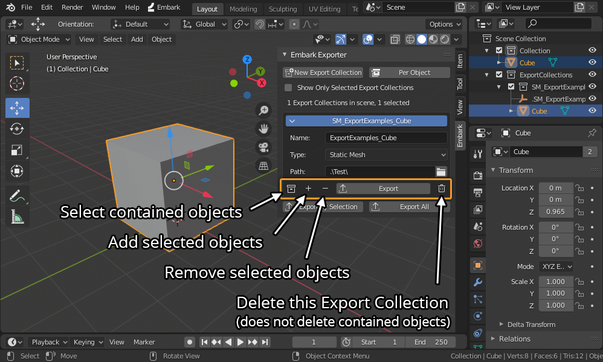

# 🐵 Embark Blender Tools

A Blender add-on containing workflow tools for game development, created and maintained by Embark Studios.

The add-on includes [tools](#tools) for standardized import/export workflow, 3D modelling and new object types.

We welcome Pull Requests - if you would like to contribute, please check out the [Contributing](#contributing) section.

## Prerequisites

* [Blender 2.81](https://www.blender.org/download/)

## Installation

1. Download [the latest release of the addon](https://github.com/EmbarkStudios/blender-tools/releases) from Github!
1. Launch Blender and navigate to _Edit -> Preferences_, then choose the _Add-ons_ section:

   
1. Click _Install_ in the top right of the Preferences window
1. Use the file browser to navigate to the file you downloaded, then click _Install Add-on_:

   
1. Find the Embark Addon in the add-ons list, and ensure that the checkbox is checked:

   

### Updating the add-on
The tools contain built-in update functionality, so you should only need to run through this process once!

If you don't want the add-on to auto-update, please disable the **Automatically check for updates** checkbox in the
_Preferences_ section of the Embark Addon.

## Tools

Below is a concise list of some of the functionality offered by the Embark Blender Tools.

### Export Collections
Export Collections are used to define lists of objects that will be exported to a single model file.
The tools all use FBX for exports to game engines like Unreal, and OBJ for highpoly objects for baking.

#### Working with Export Collections
There are  a few things to keep in mind when working with the Embark Export Collection tools:
1. You must configure your **Project source folder** in the Embark Addon's _Preferences_ panel, as shown below.

   

   This sets the absolute root for exporting, and all export paths will be stored as paths relative to this.
1. All Blender scenes must be saved relative to the **Project source folder**
1. Export Collections will fail to export if your scene is not saved, or is saved under a path outside of the **Project source folder**!

#### Creating a new Export Collection
You can create a new Export Collection from selected objects as shown here:
1. Select one or more objects that you would like to export
1. Click on the _Embark_ tab to the right of the 3D View
1. Click on Create New Export Collection

   
1. In the File Browser that pops up, select the location and name for your new export.
   
   * On the right, you will see some settings:

     

   * Select the preset that is appropriate for your asset type - this will enforce some naming conventions
   * If you disable **Export Immediately**, the Export Collection will be created, but not exported

You will now see a new Collection in the outliner, named to match the export file name you chose.

#### Modifying an existing Export Collection

Export Collections are stored in the Blender scene, and can be modified and exported at any time.

All Export Collections are shown in the _Embark_ panel, and Export Collections that contain the selected object will be auto-expanded.

You can use the fields on each Export Collection to modify:
* Output file name
* Export type
* Output folder (relative to your Embark Addon's configured **Project source folder**)

Each Export Collection shown in the panel also has convenience functionality on the icon buttons shown above:
* **Select** objects contained in this Export Collection
* **Add** selected objects to this Export Collection
* **Remove** selected objects from this Export Collection
* **Export** this Export Collection
* **Delete** this Export Collection from the scene
  * Note that the objects it contained will remain in the scene!

#### Exporting objects and Export Collections

You can always press the **Export All** button from the _Embark_ panel, and you can also use the
_Embark -> Export All Collections_ menu item if you aren't in a context that shows the panel.
This will export every Export Collection in the current scene.

If you are working on a particular object, you can use the **Export by Selection** button from the _Embark_ panel.
This is also accessible via the _Embark -> Export Collection(s) by Selection_ menu item.
This will export only those Export Collections that contain _any_ of the currently selected objects.

These commands can all be bound to hotkeys or added to the Quick menu by right-clicking on them from the _Embark_ menu.

### Import
Accessed from the _Embark -> Import_ menu item.

Imports objects (FBX, OBJ, PLY) using hard-coded standard settings to enforce consistency.

### Spiral Curve
Accessed from the _Embark -> Spiral_ menu item, or the 3D viewport's _Add -> Curve -> Spiral_ menu item.

Adds a parametric spiral curve object to the scene.

### Connect Contextual
Mesh editing, connects verts/edges/faces depending on selection.

### Frame Contextual
Accessed from the 3D viewport's _View -> Frame Contextual_ menu item.

Frames the selection in the 3D viewport, or frames the whole scene if nothing is selected.

## Contributing

We welcome community contributions to this project.

Please read our [Contributor Guide](CONTRIBUTING.md) for more information on how to get started.

## License

Licensed under either of

* Apache License, Version 2.0, ([LICENSE-APACHE](LICENSE-APACHE) or http://www.apache.org/licenses/LICENSE-2.0)
* MIT license ([LICENSE-MIT](LICENSE-MIT) or http://opensource.org/licenses/MIT)

at your option.

### Contribution

Unless you explicitly state otherwise, any contribution intentionally submitted for inclusion in the work by you, as defined in the Apache-2.0 license, shall be dual licensed as above, without any additional terms or conditions.
